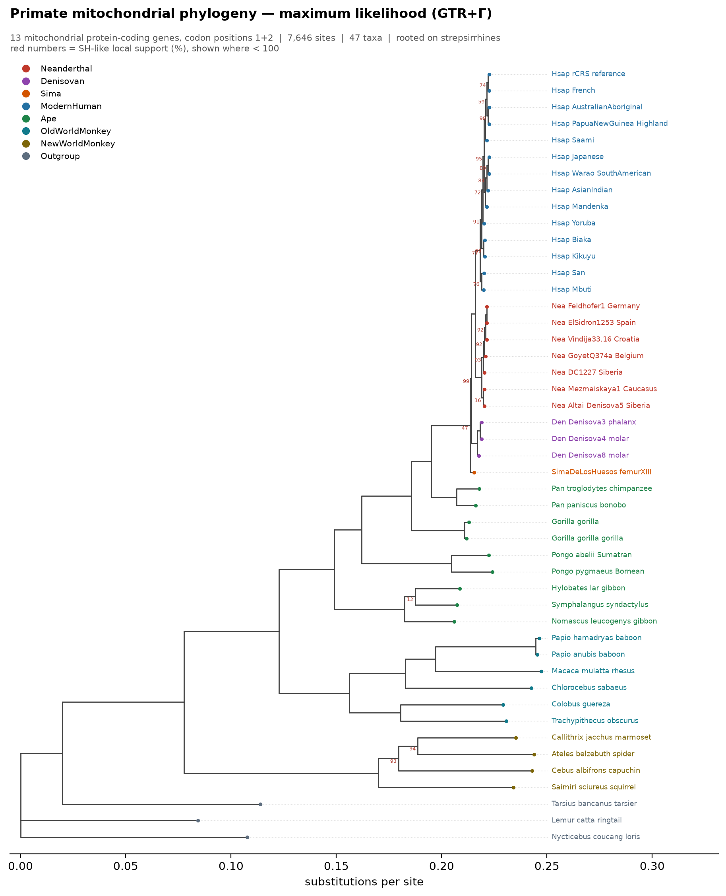

# Primate mitochondrial phylogeny

A Jupyter notebook that downloads complete mitochondrial genomes for apes, monkeys, modern humans and
ancient hominins from NCBI GenBank, then builds phylogenetic trees with a standard toolchain.

**[`primate_mtdna_phylogeny.ipynb`](primate_mtdna_phylogeny.ipynb)** — runs end to end in about 90
seconds after the first download. It ships with all outputs already executed, so it can be read
without running anything.

## What it does

| Step | Tool |
|---|---|
| Sequence retrieval | NCBI Entrez (`Bio.Entrez`) |
| Gene extraction | GenBank CDS annotations (`Bio.SeqIO`) |
| Multiple alignment | MAFFT — codon-aware, via protein-guided back-translation |
| Distance / NJ + bootstrap | NumPy + `Bio.Phylo` |
| Maximum likelihood | VeryFastTree (FastTree-compatible), GTR + Γ |
| Visualisation | Matplotlib |

**47 taxa:** 7 Neanderthals, 3 Denisovans, the ~430 ka Sima de los Huesos femur, 14 modern humans
spanning the major mtDNA lineages, 9 apes, 10 monkeys, and 3 outgroup primates.

**Two analyses.** A deep primate tree built from a codon-aware supermatrix of the 13 mitochondrial
protein-coding genes, and a *Homo*-focused whole-genome tree rooted on *Pan*.

## Results

The deep tree recovers 16 of 17 textbook primate clades, almost all at full support. The hominin tree
resolves the archaic relationships completely — including **Sima de los Huesos grouping with the
Denisovans rather than the Neanderthals** (100% bootstrap, 1.00 SH-like), the result reported by
Meyer *et al.* (2014).



## Setup

```bash
python3 -m venv .venv && source .venv/bin/activate
pip install -r requirements.txt
```

External tools — MAFFT is required, VeryFastTree is optional (without it the notebook falls back to
neighbour joining):

```bash
brew install mafft veryfasttree
```

On Debian/Ubuntu:

```bash
sudo apt install mafft fasttree
```

NCBI requires a contact address for Entrez queries. The notebook reads it from the environment and
will stop if it is not set:

```bash
export NCBI_EMAIL="you@example.com"
```

An optional `NCBI_API_KEY` raises the rate limit from 3 to 10 requests per second.

## Running it

```bash
jupyter lab primate_mtdna_phylogeny.ipynb
```

Or headless:

```bash
jupyter nbconvert --to notebook --execute --inplace primate_mtdna_phylogeny.ipynb
```

## Layout

```
data/genbank_cache.gb    all 47 GenBank records (delete to force a re-download)
data/work/               intermediate FASTA and alignments
results/                 trees (Newick), alignments, figures, CSV tables
```

`data/` is git-ignored — it is a cache the notebook rebuilds on first run. `results/` is committed so
the outputs can be read without running anything.

Key outputs in `results/`:

- `tree_ml_fasttree.nwk`, `tree_nj_bootstrap.nwk` — deep primate trees
- `tree_hominin_ml.nwk`, `tree_hominin_nj.nwk` — hominin trees
- `supermatrix_13genes_codon.fasta` + `partitions.txt` — ready for IQ-TREE or RAxML
- `clade_checks.csv`, `hominin_clade_checks.csv` — recovered clades and their support
- `fig1`–`fig4` — alignment QC, both trees, divergence summary

To take the supermatrix further with model selection and ultrafast bootstrap:

```bash
iqtree -s results/supermatrix_13genes_codon.fasta -p results/partitions.txt -m MFP -B 1000
```

## Notes on the approach

Two problems in the data drive most of the design, and the notebook demonstrates both rather than
asserting them:

- **Mitochondrial genomes are circular**, and GenBank records are cut at inconsistent points — some
  begin in the control region, others at tRNA-Phe. Naive whole-genome alignment across the primates
  would be reconciling circular permutations. The deep analysis works from CDS annotations instead;
  the hominin analysis rotates every record to tRNA-Phe so whole genomes *can* be aligned.
- **Third codon positions saturate** over primate-scale divergences, so the deep tree uses first and
  second positions only. The hominin tree keeps every site, where nothing is saturated.

Gene naming across GenBank is inconsistent (`COX1`, `cox1`, `COI`, `cytochrome c oxidase subunit I`),
and at least one record — Denisova 4, `FR695060.1` — has a genuinely wrong `gene` qualifier on its
ATP6 coding sequence. Both are handled in the extraction step.

## Caveats

Mitochondrial DNA is a single non-recombining locus, so this is one gene tree, not a species tree —
the Sima result is exactly where the two diverge. Branch lengths are substitutions per site, not
time; dating would need a calibrated relaxed-clock analysis. Support values from the two methods are
not interchangeable.

## Data sources

All sequences are public GenBank records; accessions are listed in the notebook and in
`results/taxon_table.csv`. Modern human sequences come from the Ingman *et al.* (2000) global panel.
Each ancient genome's primary publication is read directly from its GenBank record in section 2.
